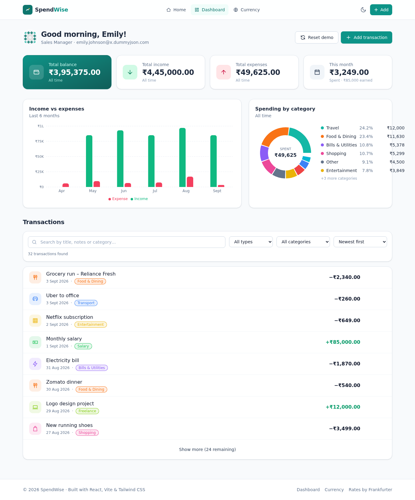

# SpendWise – Personal Expense Tracker

> **YUVA Internship · Junior Full Stack Developer · Week 2 Task – Front-End Application Development**
> Part of the **SmartSpend** internship project ([Badal00999/SmartSpend](https://github.com/Badal00999/SmartSpend)). Week 1 covered the project plan, requirements and architecture; this Week 2 deliverable is the complete front-end application, code-named **SpendWise**.

SpendWise is a responsive, accessible single-page application (SPA) for tracking personal income and expenses. It is built with **React 19**, **Vite**, **Tailwind CSS v4** and **React Router v7**, integrates two live public REST APIs, and ships with automated tests.

> **Week 3 update:** the app now also talks to its own back-end – the **SpendWise REST API** (`../week3-backend-spendwise-api/`, Node.js + Express + MongoDB). Sign in (or use the demo account) and transactions are stored on the server; without an account the app keeps working exactly as in Week 2 with `localStorage`. See [§8 Back-end integration](#8-back-end-integration-apis).



---

## Table of contents

1. [Features](#1-features)
2. [Views / pages](#2-views--pages)
3. [Tech stack & libraries](#3-tech-stack--libraries)
4. [Running the project locally](#4-running-the-project-locally)
5. [Project structure](#5-project-structure)
6. [Development process](#6-development-process)
7. [Architecture & design patterns](#7-architecture--design-patterns)
8. [Back-end integration (APIs)](#8-back-end-integration-apis)
9. [Responsive design](#9-responsive-design)
10. [Accessibility](#10-accessibility)
11. [Testing & usability simulation](#11-testing--usability-simulation)
12. [Best practices checklist](#12-best-practices-checklist)
13. [Known limitations & future work](#13-known-limitations--future-work)

---

## 1. Features

| Area | What it does |
|---|---|
| **Transactions (CRUD)** | Add, edit and delete income/expense entries with title, amount, type, category, payment method, date and notes. |
| **Validation** | Inline, accessible form validation (required fields, positive amounts, no future dates, length limits). |
| **Dashboard analytics** | Total balance / income / expenses / this-month cards, a 6-month income-vs-expense bar chart and a category donut chart. |
| **Search, filter, sort** | Debounced text search, filter by type and category, four sort orders, "Show more" pagination. |
| **Detail view** | Full breakdown of a single transaction, share-of-spend meters, related transactions, edit & delete. |
| **Live currency converter** | Real exchange rates from the Frankfurter API with loading skeletons, error state and retry. |
| **Remote user profile** | Dashboard greeting/avatar fetched from the DummyJSON API. |
| **Dark mode** | Toggle persisted in `localStorage`; respects `prefers-color-scheme` on first visit. |
| **Persistence** | Transactions are stored in `localStorage`, seeded with realistic demo data on first launch; "Reset demo" restores it. |
| **Toasts, empty states, 404** | Feedback for every action; friendly placeholders when lists are empty; catch-all not-found page. |
| **Code-splitting** | Each page is lazy-loaded so the initial bundle stays small. |

## 2. Views / pages

The task required **at least three interconnected views**. SpendWise has five:

| Route | View | Purpose |
|---|---|---|
| `/` | **Landing page** | Hero with live totals, feature grid, "how it works", CTA. |
| `/dashboard` | **User dashboard** | Stat cards, charts, remote profile, filterable transaction list, add/edit/delete modals. `?new=1` deep-links to the Add dialog. |
| `/transactions/:id` | **Detail view** | Everything about one transaction + insights + related items. |
| `/convert` | **Currency converter** | Live API-driven converter and rate table. |
| `*` | **404** | Not-found page with links back. |

Navigation: sticky navbar (collapses to a hamburger on mobile), footer links, breadcrumbs on the detail page, in-content links (list row → detail, related → detail, CTA → dashboard) and a "Skip to main content" link.

Wireframes for every view are in [`docs/wireframes/`](docs/wireframes/) (SVG) and screenshots in [`docs/screenshots/`](docs/screenshots/).

## 3. Tech stack & libraries

| Package | Version | Why |
|---|---|---|
| [React](https://react.dev) | 19 | Component model, hooks, Suspense/lazy for code-splitting. |
| [Vite](https://vite.dev) | 8 | Instant dev server with HMR and optimised production builds. |
| [Tailwind CSS](https://tailwindcss.com) | 4 | Utility-first styling, design tokens via `@theme`, class-based dark mode. Chosen for speed of iteration and consistency. |
| [React Router](https://reactrouter.com) | 7 | Client-side routing, nested layout route, `NavLink` active state, URL search params. |
| [Recharts](https://recharts.org) | 3 | Declarative, responsive SVG charts (bar + donut). |
| [Vitest](https://vitest.dev) + [Testing Library](https://testing-library.com) | 4 / 16 | Unit, component and integration tests that simulate real user interaction. |
| [oxlint](https://oxc.rs) | 1 | Fast linter (React hooks rules, etc.). |

No UI component kit was used – every component (`Button`, `Modal`, `Badge`, `StatCard`, …) is hand-written so the code is fully explainable.

## 4. Running the project locally

**Prerequisites:** Node.js **18 or newer** (tested on Node 20) and npm.

```bash
# 1. Unzip the archive and enter the folder
cd spendwise

# 2. Install dependencies
npm install

# 3. Start the development server (http://localhost:5173)
npm run dev
```

Other scripts:

| Command | Description |
|---|---|
| `npm run dev` | Start Vite dev server with hot reload. |
| `npm run build` | Create an optimised production build in `dist/`. |
| `npm run preview` | Serve the production build locally to verify it. |
| `npm test` | Run the automated test suite once (48 tests). |
| `npm run test:watch` | Run tests in watch mode. |
| `npm run lint` | Lint the source with oxlint. |

> The currency converter and profile greeting need internet access (they call public APIs). Everything else works fully offline.

## 5. Project structure

> Week 3 additions: `services/api.js`, `services/transactionsApi.js`, `context/AuthContext.jsx`, `pages/AuthPage.jsx`, `test/api.test.jsx`, `.env.example`.

```
spendwise/
├── index.html                 # HTML shell (meta description, theme-color, noscript)
├── vite.config.js             # Vite + Tailwind plugin + Vitest config
├── package.json
├── .oxlintrc.json             # Lint rules
├── docs/
│   ├── wireframes/            # 01-landing, 02-dashboard, 03-detail-and-modal, 04-converter (SVG)
│   └── screenshots/           # Desktop, mobile and dark-mode captures
├── public/favicon.svg
└── src/
    ├── main.jsx               # Entry – mounts <App/> in StrictMode
    ├── App.jsx                # Providers + route table (lazy-loaded pages)
    ├── index.css              # Tailwind import, design tokens, focus ring, reduced-motion
    ├── pages/                 # One file per route/view
    │   ├── LandingPage.jsx
    │   ├── DashboardPage.jsx
    │   ├── TransactionDetailPage.jsx
    │   ├── ConverterPage.jsx
    │   └── NotFoundPage.jsx
    ├── components/
    │   ├── layout/            # Layout (shell), Navbar, Footer
    │   ├── ui/                # Button, Modal, Badge, Icon, StatCard, Skeleton, EmptyState, ErrorBoundary
    │   ├── transactions/      # TransactionForm, TransactionItem, FilterBar
    │   └── charts/            # TrendBars, CategoryDonut
    ├── context/               # TransactionsContext (reducer), ThemeContext, ToastContext
    ├── hooks/                 # useFetch, useDebounce, useDocumentTitle
    ├── services/              # exchangeRateApi, userApi, storage (localStorage repository)
    ├── utils/                 # categories (constants), format (Intl helpers), stats (pure calculations)
    └── test/                  # setup + unit / component / integration tests
```

The folder layout follows a **feature-by-layer** convention: pages compose components; components read state through hooks/contexts; contexts call services; services are the only place that talks to `fetch` or `localStorage`.

## 6. Development process

The work was carried out in the phases suggested by the brief:

1. **Environment setup** – scaffolded with `npm create vite@latest` (React template), added Tailwind v4 via the official Vite plugin, React Router, Recharts, Vitest + Testing Library. Configured the dev server to listen on the network so the app could be tested on a phone.
2. **Requirements & information architecture** – decided on the five routes above and the transaction data model (`id, title, amount, type, category, payment, date, notes, createdAt`).
3. **Wireframing** – sketched desktop + mobile layouts for each view (see `docs/wireframes/`). Key decisions made here: stat cards collapse 4 → 2 → 1 columns; charts sit side by side on `lg` and stack below; the same form is reused for Add and Edit inside a modal; the detail view uses a 2/3 + 1/3 grid.
4. **Foundations first** – design tokens (`@theme` colours, fonts, animations), global focus ring, `.card / .input / .label` component classes, then the generic UI kit (`Button`, `Modal`, `Icon`, `Badge`, …).
5. **Data layer** – pure `utils/stats.js` functions, the `storage.js` repository with seed data, the `TransactionsContext` reducer. These were written before any page so pages only had to compose.
6. **Pages & interactivity** – Landing → Dashboard → Detail → Converter, wiring filters, modals, toasts and URL state.
7. **API integration** – `useFetch` hook with `AbortController`, then the Frankfurter and DummyJSON services with loading / error / retry UI.
8. **Testing & usability simulation** – unit tests for pure logic, component tests for the form, integration tests navigating the whole app; plus scripted headless-browser runs (Playwright) on desktop and a 390 px mobile viewport to click through add → search → detail → edit → delete, keyboard navigation, dark-mode persistence and the mobile menu.
9. **Polish** – linter clean-up (removed all *setState-inside-useEffect* patterns in favour of derived state), fixed a focus-loss bug caused by defining a sub-component inside the form, dark-mode contrast pass, production build check.

## 7. Architecture & design patterns

| Pattern | Where | Why |
|---|---|---|
| **Container / presentational split** | `pages/*` (containers) vs `components/*` (presentational) | Pages own data & handlers; components stay reusable and easy to test. |
| **Context + Reducer** (Flux-style state) | `context/TransactionsContext.jsx` | Predictable state transitions (`ADD / UPDATE / DELETE / RESET / CLEAR`), no prop-drilling, no external state library needed. |
| **Provider pattern** | `ThemeProvider`, `ToastProvider`, `TransactionsProvider` | Cross-cutting concerns exposed via custom hooks (`useTheme`, `useToast`, `useTransactions`) that throw a helpful error if used outside their provider. |
| **Repository / service layer** | `services/storage.js`, `services/*Api.js` | Components never call `fetch` or `localStorage` directly – swapping to a real back-end is a one-file change. |
| **Custom hooks** | `useFetch`, `useDebounce`, `useDocumentTitle` | Encapsulate reusable behaviour (request cancellation, debouncing, tab titles). |
| **Pure functions for business logic** | `utils/stats.js`, `utils/format.js`, `validateTransaction()` | Deterministic, side-effect-free → trivially unit-testable. |
| **Compound / polymorphic components** | `Button` renders `<button>` or router `<Link>` (`to` prop) | Identical styling for actions and navigation while staying semantic. |
| **Layout route** | `components/layout/Layout.jsx` + `<Outlet/>` | One shell (skip link, navbar, footer, scroll-to-top) shared by all pages. |
| **URL as state** | `/dashboard?new=1` | The Add dialog is deep-linkable and works with the browser back button. |
| **Error boundary** | `components/ui/ErrorBoundary.jsx` | A render crash shows a recoverable screen instead of a blank page. |
| **Code-splitting** | `React.lazy` + `Suspense` in `App.jsx` | Each page is its own chunk (see `npm run build` output). |
| **Derived state over effects** | Pagination key in `DashboardPage`, menu state in `Navbar` | Avoids cascading renders; keeps the React-hooks linter at 0 warnings. |

## 8. Back-end integration (APIs)

| Service | Endpoint | Used for |
|---|---|---|
| **SpendWise API** (own back-end, Week 3) | `/api/v1/auth/*`, `/api/v1/transactions*`, `/api/v1/stats/*` | Accounts (JWT) and server-side storage of transactions when signed in. |
| **Frankfurter** (ECB reference rates, no API key) | `GET https://api.frankfurter.dev/v1/latest?base=INR&symbols=USD,EUR,…` | Currency converter + rate table. |
| **DummyJSON** | `GET https://dummyjson.com/users/1?select=firstName,lastName,email,image,company` | Simulated profile on the dashboard in guest mode. |
| **localStorage** (repository) | `spendwise.transactions.v1`, `spendwise.settings.v1`, `spendwise.auth.v1` | Guest-mode transactions, theme, and the saved JWT. |

### 8.1 Running with the Week 3 back-end

```bash
# terminal 1 – API (see ../week3-backend-spendwise-api/README.md)
cd ../week3-backend-spendwise-api && npm install && npm run dev      # http://localhost:4000

# terminal 2 – this app
npm install && npm run dev                                          # http://localhost:5173
```
Open **http://localhost:5173/login** and click **"Try the demo account"** (`demo@spendwise.app` / `Demo1234`) or register a new account.
The Vite dev server proxies `/api/*` to `http://localhost:4000` (`vite.config.js`), so no CORS setup is needed. To point the app at a hosted API, set `VITE_API_URL=https://…/api/v1` (see `.env.example`).

### 8.2 How the integration works

```
AuthProvider (status: guest | loading | authenticated)
   └─ TransactionsProvider  ──►  source = 'api'   → services/transactionsApi.js → REST API
                             └►  source = 'local' → services/storage.js        → localStorage
```
* `services/api.js` – tiny `fetch` wrapper: base URL, `Authorization: Bearer <jwt>`, unwraps the API's `{ success, data, meta }` envelope and converts `{ success:false, error }` into an `ApiError` with `status`, `code` and per-field `details`.
* `context/AuthContext.jsx` – login / register / logout, restores the session from a saved token via `GET /auth/me`, drops expired tokens (401) automatically.
* `context/TransactionsContext.jsx` – same `useTransactions()` hook as before; in API mode every add / edit / delete is sent to the server first and the list is updated from the server response (so validation errors surface as toasts). Server data is never mirrored into `localStorage`.
* **Import from guest mode** – transactions created before signing in can be pushed to the account in one call (`POST /transactions/bulk`).
* Pages `/login` and `/register` show the API's field-level validation messages (422) and its `401 Invalid email or password` response.

All requests go through `useFetch`, which:
* tracks `loading / error / data`,
* cancels in-flight requests with `AbortController` when inputs change or the component unmounts (prevents race conditions and state updates on unmounted components),
* exposes `refetch()` for "Try again" buttons.

The exchange-rate service additionally applies a 10-second timeout and normalises errors into user-friendly messages.

## 9. Responsive design

Mobile-first Tailwind breakpoints (`sm 640 · md 768 · lg 1024 · xl 1280`):

* **Navbar** – full links on `md+`, hamburger + vertical menu below (with `aria-expanded`, Esc-to-close, auto-close on navigation).
* **Stat cards** – `grid-cols-1 → sm:grid-cols-2 → xl:grid-cols-4`.
* **Charts** – stacked on mobile, `lg:grid-cols-5` (3 + 2) on desktop; Recharts `ResponsiveContainer` resizes with the card.
* **Filter bar** – controls stack vertically, become a single row on `md+`.
* **List rows** – edit/delete icons hidden on touch widths (actions live on the detail page instead); a chevron hints that the row is tappable.
* **Detail page** – single column → `lg:grid-cols-3` (main card spans 2).
* **Modal** – `w-[calc(100%-2rem)]` with a max width; body scroll locked while open.
* Fluid typography (`text-4xl sm:text-5xl lg:text-6xl`), `min-w-0` + `truncate` to prevent overflow, `tabular-nums` for aligned figures.

Verified with headless-browser screenshots at 1366 px and 390 px (see `docs/screenshots/`).

## 10. Accessibility

* **Semantic landmarks**: `<header> <nav aria-label> <main id="main-content"> <footer> <article> <section aria-labelledby>`; exactly one `<h1>` per page; logical heading order.
* **Skip link** – first Tab stop is "Skip to main content" (verified).
* **Keyboard** – everything reachable and operable by keyboard; global `:focus-visible` ring; native `<dialog>` traps focus and closes on Esc; focus returns to the opener; first invalid field is focused on submit.
* **Forms** – every control has a `<label>`; errors use `role="alert"`, `aria-invalid` and `aria-describedby`; type toggle is a real radio group.
* **Live regions** – toasts (`aria-live="polite"`), filter result count, converter result.
* **Charts** – marked `aria-hidden`; a visually-hidden `<table>` (trend) and a real text legend (donut) provide the same information.
* **Icons** – decorative by default (`aria-hidden`), icon-only buttons have `aria-label`s; `NavLink` sets `aria-current="page"`.
* **Colour** – information is never conveyed by colour alone (+/− signs, badges with text); dark mode maintains contrast.
* **Motion** – `prefers-reduced-motion` disables animations.
* **Document titles** update per route (`useDocumentTitle`); `<html lang="en">`; meta description/theme-color present.

A scripted audit of the dashboard found **0 images without `alt`, 0 unnamed buttons, 0 unlabelled form controls**.

## 11. Testing & usability simulation

```bash
npm test
```

| File | Type | Covers |
|---|---|---|
| `stats.test.js` | Unit | Totals, category grouping, filtering/sorting, percentages. |
| `format.test.js` | Unit | Currency (Indian grouping), dates, months. |
| `TransactionForm.test.jsx` | Component | Validation messages + ARIA attributes, successful submit with normalised values, income/expense category switching, focus retention while typing. |
| `TransactionsContext.test.jsx` | Unit + hook | Reducer transitions, add/update/delete via the hook, `localStorage` persistence, misuse error. |
| `App.test.jsx` | Integration | Landing → Dashboard navigation with `aria-current`, list → detail view, 404 route, converter output with a mocked API. |
| `api.test.jsx` | Unit + hook + component | API client (envelope unwrapping, bearer token, `ApiError` field details, 204, network errors), `AuthProvider` (login/logout, session restore, expired token), `TransactionsProvider` in API mode (load, create/update/delete round-trips, error propagation), `AuthPage` (401 message, demo login redirect). |

**Result: 6 files, 48 tests, all passing.**

The Week 3 integration was additionally verified end-to-end against the real API in headless Chromium: wrong password → 401 message · demo login → dashboard "Synced with SpendWise API" · add → reload (data served by the API, not `localStorage`) · edit on the detail page · delete · sign out · register a new account → empty dashboard → "Add demo data" bulk import. Screenshots live in `../week3-backend-spendwise-api/docs/screenshots/`.

In addition, the following end-to-end flows were simulated in a headless Chromium browser at desktop and mobile sizes (no console errors or warnings): open Add modal via deep-link → submit empty form (errors shown) → fill & save (toast) → search → open detail → edit → delete (redirect) → keyboard skip-link → dark-mode toggle persists across reload → currency conversion & swap → mobile hamburger open/navigate/Esc.

## 12. Best practices checklist

- [x] Modular, single-responsibility files with JSDoc headers explaining *why*
- [x] Constants centralised (`utils/categories.js`) – no magic strings scattered across the UI
- [x] Controlled components, immutable state updates, memoised derived data (`useMemo`)
- [x] No `setState` inside `useEffect`; effects only synchronise with external systems
- [x] Request cancellation, timeouts and error boundaries – no unhandled promise states
- [x] Semantic HTML & WCAG-minded markup (see §10)
- [x] Mobile-first responsive layout (see §9)
- [x] Route-level code-splitting; production build verified
- [x] Linter clean (`npm run lint` → 0 warnings, 0 errors) and automated tests
- [x] `.gitignore` excludes `node_modules` and `dist`; ZIP contains source only

## 13. Known limitations & future work

* ~~Data lives in the browser (`localStorage`)~~ → **done in Week 3**: signed-in users are served by the SpendWise REST API; guest mode still uses `localStorage`.
* ~~Single demo user – authentication was out of scope~~ → **done in Week 3**: JWT-based register / login / logout.
* The dashboard still aggregates client-side; the API's `/stats/*` endpoints could replace this for very large histories.
* Budgets / recurring transactions / CSV export would be natural next features.
* Rates come from the ECB reference set (working days only), so weekend values show the last business day.

---

*Built by **Badal** · YUVA Internship (Junior Full Stack Developer) · Week 2 · September 2026*
