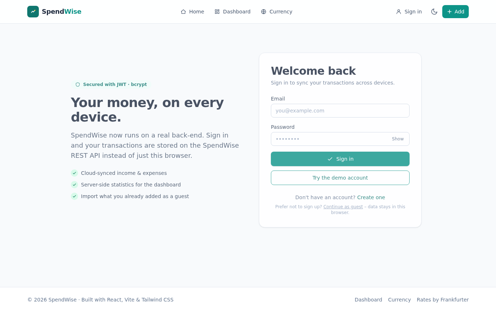
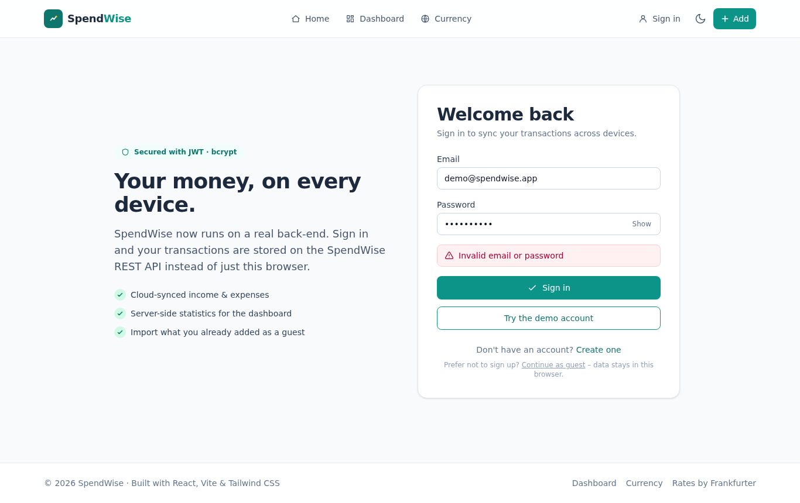
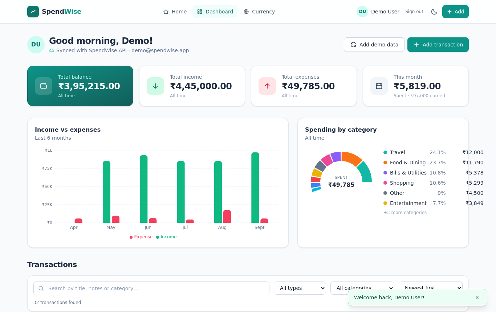
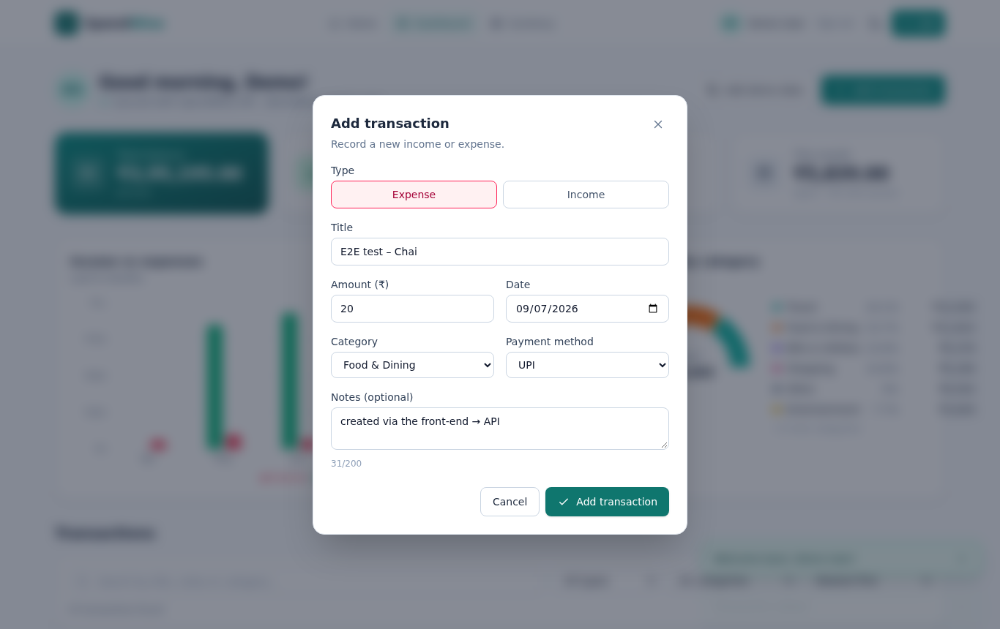
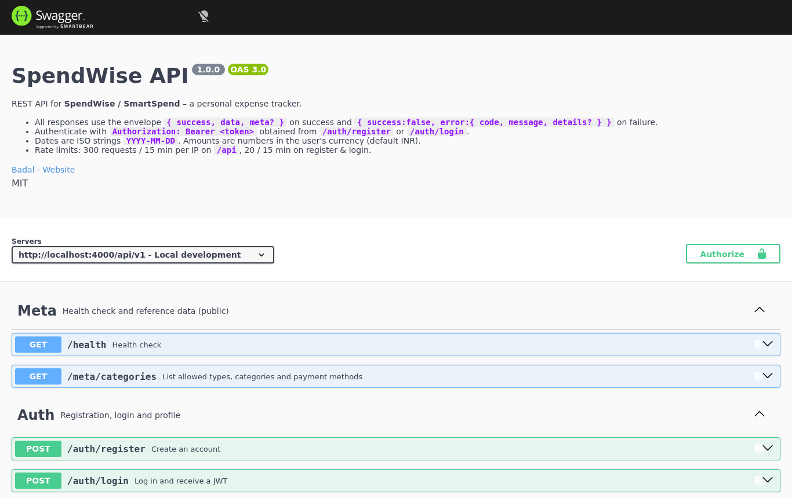
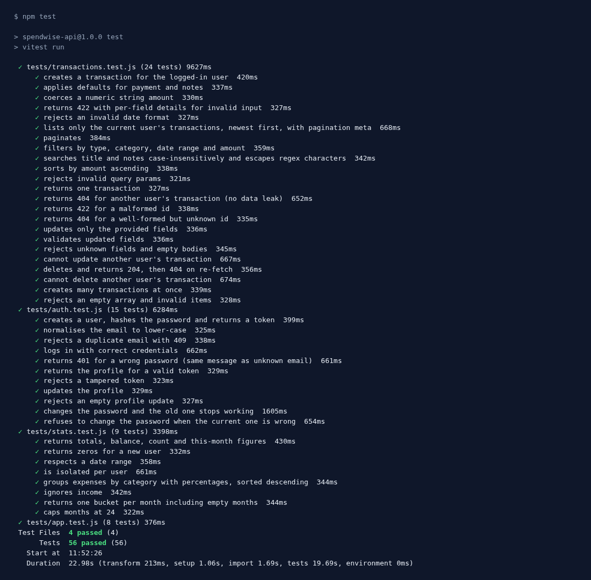

# SpendWise API – Back-End for the SmartSpend Project

> **YUVA Internship · Junior Full Stack Developer · Week 3 Task – Back-End API Development**
> Part of **SmartSpend** ([Badal00999/SmartSpend](https://github.com/Badal00999/SmartSpend)). Week 1 = plan & architecture · Week 2 = React front-end (SpendWise) · **Week 3 = this REST API** that the front-end now talks to.

A secure, tested, documented RESTful API built with **Node.js 20 + Express 5 + MongoDB (Mongoose)**. It provides JWT authentication, full CRUD for income/expense transactions with filtering/search/pagination, and aggregation endpoints that power the dashboard charts.

| | |
|---|---|
| **Interactive docs** | `http://localhost:4000/api/docs` (Swagger UI, "Try it out" works) |
| **API reference (Markdown)** | [`docs/API.md`](docs/API.md) |
| **OpenAPI 3 spec** | [`src/docs/openapi.yaml`](src/docs/openapi.yaml) · served at `/api/v1/openapi.json` |
| **Postman collection** | [`docs/SpendWise-API.postman_collection.json`](docs/SpendWise-API.postman_collection.json) |
| **Tests** | 56 automated tests (Vitest + Supertest, in-memory MongoDB) – `npm test` |

---

## Table of contents
1. [Features](#1-features)
2. [Tech stack](#2-tech-stack)
3. [Quick start](#3-quick-start)
4. [Configuration](#4-configuration)
5. [Scripts](#5-scripts)
6. [API overview](#6-api-overview)
7. [Database schema](#7-database-schema)
8. [Project structure](#8-project-structure)
9. [Architecture & request pipeline](#9-architecture--request-pipeline)
10. [Security measures](#10-security-measures)
11. [Error handling & validation](#11-error-handling--validation)
12. [Testing](#12-testing)
13. [Connecting the Week 2 front-end](#13-connecting-the-week-2-front-end)
14. [Development process](#14-development-process)
15. [Future work](#15-future-work)

---

## 1. Features
- **Authentication** – register, login, profile, change password; bcrypt-hashed passwords; signed JWTs (7-day expiry, issuer check).
- **Transactions CRUD** – create, read, update (partial), delete, bulk import; every record is scoped to its owner.
- **Querying** – filter by type / category / payment / date range / amount range, full-text-ish search on title & notes, 6 sort orders, page-based pagination with metadata.
- **Statistics** – summary (income, expense, balance, this-month), spend by category with percentages, monthly income-vs-expense series – all computed with MongoDB aggregation pipelines.
- **Validation** – every body, query and path param validated with Zod; field-level error messages.
- **Consistent envelopes** – `{ success, data, meta }` / `{ success:false, error:{ code, message, details } }`.
- **Security** – Helmet headers, CORS allow-list, global + auth-specific rate limiting, 100 kB body limit, no stack traces in production, credential-enumeration-safe login.
- **Zero-setup mode** – if `MONGODB_URI` is empty, an in-memory MongoDB starts automatically and demo data is seeded, so `npm install && npm start` is all an evaluator needs.
- **Ops** – health endpoint, request logging (morgan), graceful shutdown on SIGINT/SIGTERM.

## 2. Tech stack
| Package | Purpose |
|---|---|
| **express 5** | HTTP framework (native async error propagation) |
| **mongoose 9** | MongoDB ODM – schemas, indexes, validation |
| **zod 4** | Request validation & coercion |
| **jsonwebtoken** / **bcryptjs** | JWT signing & verification / password hashing (12 salt rounds) |
| **helmet**, **cors**, **express-rate-limit** | Security middleware |
| **swagger-ui-express** + **yaml** | Serve the OpenAPI document as interactive docs |
| **morgan**, **dotenv** | Logging, configuration |
| **vitest**, **supertest**, **mongodb-memory-server** | Test runner, HTTP assertions, throw-away database |
| **nodemon** | Dev auto-reload |

## 3. Quick start
**Prerequisites:** Node.js **18+** (tested on 20). MongoDB is *optional* (see below).

```bash
# 1. install
npm install

# 2. configure (defaults are fine for a local demo)
cp .env.example .env

# 3. run
npm run dev          # auto-reload, http://localhost:4000
# or
npm start
```

Then open **http://localhost:4000/api/docs**.

> **No MongoDB installed?** Leave `MONGODB_URI` empty in `.env` – the server starts an in-memory MongoDB and seeds a demo account:
> **`demo@spendwise.app` / `Demo1234`** with ~32 transactions. (Data resets on restart.)
>
> **Have MongoDB?** Set `MONGODB_URI=mongodb://127.0.0.1:27017/spendwise` (or an Atlas `mongodb+srv://…` URI) and run `npm run seed` once to load the demo data.

First call:
```bash
curl -X POST http://localhost:4000/api/v1/auth/login -H 'Content-Type: application/json' \
     -d '{"email":"demo@spendwise.app","password":"Demo1234"}'
```

## 4. Configuration
All settings come from environment variables (`.env` is read automatically; see `.env.example`).

| Variable | Default | Description |
|---|---|---|
| `PORT` | `4000` | HTTP port |
| `NODE_ENV` | `development` | `production` enables strict checks & hides stack traces |
| `MONGODB_URI` | *(empty ⇒ in-memory)* | MongoDB connection string |
| `JWT_SECRET` | dev fallback | **Required in production**, ≥ 32 chars |
| `JWT_EXPIRES_IN` | `7d` | Token lifetime |
| `CORS_ORIGIN` | `http://localhost:5173` | Comma-separated allowed origins (`*` to allow all) |

The app refuses to start in production without a strong `JWT_SECRET`.

## 5. Scripts
| Command | Description |
|---|---|
| `npm start` | Start the server |
| `npm run dev` | Start with nodemon auto-reload |
| `npm test` | Run the 56 automated tests once |
| `npm run test:watch` | Tests in watch mode |
| `npm run seed` | (Re)create the demo user + transactions in the configured DB |
| `npm run lint` | Syntax check |

## 6. API overview
Base URL: `http://localhost:4000/api/v1` · Protected routes need `Authorization: Bearer <token>`.

| Method | Path | Auth | Description |
|---|---|---|---|
| GET | `/health` | – | Liveness + DB state |
| GET | `/meta/categories` | – | Allowed enum values |
| POST | `/auth/register` | – | Create account → `{ user, token }` |
| POST | `/auth/login` | – | Log in → `{ user, token }` |
| GET / PATCH | `/auth/me` | ✔ | Read / update profile |
| PATCH | `/auth/password` | ✔ | Change password |
| GET | `/transactions` | ✔ | List (filters, search, sort, pagination) |
| POST | `/transactions` | ✔ | Create |
| POST | `/transactions/bulk` | ✔ | Create many (≤ 500) |
| GET / PATCH / DELETE | `/transactions/:id` | ✔ | Read / partial update / delete |
| GET | `/stats/summary` | ✔ | Totals, balance, this-month |
| GET | `/stats/by-category` | ✔ | Expense split by category |
| GET | `/stats/monthly` | ✔ | Income vs expense per month |

Full request/response details, parameters and examples: **[`docs/API.md`](docs/API.md)** or the Swagger UI.

## 7. Database schema
MongoDB (document database) with two collections. Mongoose enforces types, enums, lengths and indexes.

```
users                                   transactions
─────────────────────────────           ─────────────────────────────────────────
_id        ObjectId                     _id        ObjectId
name       String  2–60                 user       ObjectId → users._id   (indexed)
email      String  unique, lower-case   title      String  1–60
password   String  bcrypt hash,         amount     Number  0.01 – 10,000,000
           select:false                 type       'income' | 'expense'
currency   String  ISO-4217, def. INR   category   enum (11 values)
role       'user' | 'admin'             payment    enum (5 values), def. 'upi'
createdAt / updatedAt                   date       Date    (indexed)
                                        notes      String  ≤ 200
                                        createdAt / updatedAt

Indexes: users.email (unique) · transactions {user:1,date:-1} · transactions {user:1,category:1}
```
*Why MongoDB?* Transactions are self-contained documents with a fixed owner – a natural fit for a document store, and the aggregation framework handles the dashboard maths server-side. The Week 1 architecture named Supabase/PostgreSQL; the repository-style service layer in the front-end and the thin controller layer here mean either store can be used.

## 8. Project structure
```
spendwise-api/
├── src/
│   ├── server.js              # entry: connect DB → seed (demo) → listen → graceful shutdown
│   ├── app.js                 # Express app factory: middleware, docs, routes, error handling
│   ├── config/
│   │   ├── env.js             # validated environment config
│   │   └── db.js              # Mongoose connection (+ in-memory fallback)
│   ├── models/                # Mongoose schemas: User, Transaction
│   ├── validators/schemas.js  # Zod schemas for every body / query / param
│   ├── middleware/
│   │   ├── auth.js            # signToken, requireAuth (JWT), requireRole
│   │   ├── validate.js        # Zod → 422 with field errors
│   │   └── errorHandler.js    # notFound + central error → JSON envelope
│   ├── controllers/           # authController, transactionController, statsController
│   ├── routes/                # authRoutes, transactionRoutes, statsRoutes, metaRoutes
│   ├── utils/                 # ApiError, asyncHandler, response helpers, logger
│   └── docs/openapi.yaml      # OpenAPI 3.0 specification
├── tests/                     # setup, helpers, auth / transactions / stats / app tests
├── scripts/seed.js            # demo data loader
├── docs/
│   ├── API.md                 # human-readable API reference
│   └── SpendWise-API.postman_collection.json
├── .env.example  .gitignore  vitest.config.js  package.json
```

## 9. Architecture & request pipeline
Layered **routes → middleware → controllers → models**:

```
request
  → helmet (security headers)
  → cors (origin allow-list)
  → rate limiter
  → morgan (log)
  → express.json (100 kB limit)
  → route
      → validate(zodSchema)        422 on failure
      → requireAuth                401 on failure, sets req.user
      → controller (asyncHandler)  business logic, Mongoose queries scoped to req.user
  → notFound (404)
  → errorHandler → { success:false, error:{ code, message, details? } }
```

Design patterns used:
- **App factory** (`createApp()`) – tests build an app without opening a port.
- **Middleware factory** (`validate(schema, source)`) – one reusable validator for body, query and params.
- **Custom error class** (`ApiError`) with static constructors – controllers `throw ApiError.notFound()` and the handler formats it.
- **Repository-free thin controllers** – Mongoose models act as the data layer; aggregation pipelines keep heavy maths in the DB.
- **Owner scoping** – every transaction query includes `{ user: req.user.id }`, so cross-user access returns 404 rather than leaking existence.
- **Fail-fast configuration** – `env.js` validates secrets at boot.

## 10. Security measures
| Threat | Mitigation |
|---|---|
| Password theft | bcrypt (12 rounds); `select:false` so hashes never serialise; never logged |
| Token forgery / replay | HS256 JWT with issuer claim and expiry; tampered or expired → 401 |
| Brute force | 20 attempts / 15 min on register & login; 300 req / 15 min globally |
| Account enumeration | Identical 401 message for wrong email and wrong password |
| Injection / bad data | Zod validates and coerces every input; enums whitelist values; regex input is escaped before search; Mongoose `strictQuery` |
| Mass assignment | PATCH schemas are `.strict()` – unknown fields rejected; `user`/`role` never taken from the body |
| Cross-user data access | All queries scoped by owner |
| XSS / clickjacking / sniffing | Helmet defaults (`X-Content-Type-Options`, `X-Frame-Options`, HSTS, …); `X-Powered-By` removed |
| CORS abuse | Explicit origin allow-list; unknown origins get 403 |
| DoS via large payloads | `express.json({ limit: '100kb' })` → 413 |
| Information leakage | Stack traces only outside production; 5xx bodies are generic |
| Secret management | `.env` git-ignored; `.env.example` documented; production refuses weak `JWT_SECRET` |

## 11. Error handling & validation
- **Validation** happens before controllers via Zod. Failures return `422` with `details: [{ field, message }]`, e.g. `"0.amount"` for the first item of a bulk request.
- **ApiError** carries `statusCode` + stable `code` (`UNAUTHORIZED`, `NOT_FOUND`, `CONFLICT`, `VALIDATION_ERROR`, …).
- The **central handler** also normalises third-party errors: Mongoose `CastError` → 400, `ValidationError` → 422, duplicate key `11000` → 409, malformed JSON → 400, oversized body → 413, CORS rejection → 403; anything unknown → 500 (logged server-side).
- `asyncHandler` guarantees rejected promises reach the handler; `unhandledRejection` is logged; shutdown is graceful.

## 12. Testing
```bash
npm test
```
- **Runner:** Vitest · **HTTP:** Supertest against `createApp()` · **DB:** `mongodb-memory-server` (fresh instance per file, collections wiped after each test) – no external services needed.
- **56 tests / 4 files:**

| File | Covers |
|---|---|
| `auth.test.js` (15) | register (hashing, lower-casing, 409, 422 details, password policy), login (401 parity), `me` (missing / tampered / wrong-scheme token), profile update, password change |
| `transactions.test.js` (24) | create (defaults, coercion, 422 per field, date format), list (owner isolation, ordering, pagination meta, all filters, escaped search, sort, bad query), get / patch / delete (404 for others' data, 422 for bad id, strict patch), bulk |
| `stats.test.js` (9) | summary (totals, zeros, date range, isolation), by-category (percentages, income excluded), monthly (empty months filled, cap, auth) |
| `app.test.js` (8) | root, health, meta, OpenAPI + Swagger served, JSON 404, malformed JSON, security headers, CORS allow/deny |

Manual verification was also done with cURL and the Postman collection (every documented status code reproduced).

## 13. Connecting the Week 2 front-end
The React app in `../week2-frontend-spendwise/` is wired to this API (Week 3 integration work):

1. Start the API here: `npm run dev` (port 4000).
2. In `../week2-frontend-spendwise/`: `npm install && npm run dev` (port 5173). Its Vite dev server proxies `/api/*` to `http://localhost:4000`, so no CORS configuration is needed. (For a hosted API set `VITE_API_URL=https://…/api/v1` in the front-end `.env`.)
3. Open http://localhost:5173/login → **"Try the demo account"** or register.

What changed in the front-end: `services/api.js` (fetch wrapper: bearer token, envelope/`ApiError` handling), `services/transactionsApi.js`, `context/AuthContext.jsx` (login / register / logout / session restore), `pages/AuthPage.jsx` (`/login`, `/register`), `TransactionsContext` now switches between the REST API (signed in) and `localStorage` (guest) and can bulk-import guest data via `POST /transactions/bulk`. 13 new front-end tests cover the client (48 total, all passing).

### End-to-end screenshots (`docs/screenshots/`)
| | |
|---|---|
|  |  |
| Login page | Wrong password → API `401 Invalid email or password` |
|  |  |
| Dashboard fed by `GET /transactions` (demo account) | Transaction created via `POST /transactions` |
|  |  |
| Swagger UI at `/api/docs` | `npm test` – 56 passing |

## 14. Development process
1. **Requirements** – mapped the Week 2 front-end needs (CRUD, filters, dashboard numbers) to endpoints; chose Express + MongoDB.
2. **Schema design** – users & transactions with enums, limits and indexes matching the front-end constants.
3. **Foundations** – env validation, DB connector with in-memory fallback, `ApiError`, response helpers, central error handler.
4. **Auth** – model with bcrypt hook, JWT helpers, `requireAuth`, register/login/profile routes, rate limits.
5. **Transactions** – Zod schemas, controller with owner scoping, filter builder, pagination, bulk import.
6. **Stats** – aggregation pipelines; month bucketing that fills gaps.
7. **Documentation** – OpenAPI YAML → Swagger UI, `docs/API.md`, Postman collection.
8. **Testing** – 56 Supertest specs; manual cURL run-through; fixed a PATCH bug where Zod defaults blanked `notes` (now covered by a test).
9. **Hardening** – Helmet, CORS list, body limit, strict PATCH, regex escaping, graceful shutdown, seed script.

## 15. Future work
- Refresh tokens + logout/blacklist; email verification / password reset.
- Budgets, recurring transactions, CSV export endpoints.
- Docker Compose (API + MongoDB) and CI (GitHub Actions running `npm test`).
- Deploy to Render/Railway with MongoDB Atlas.

---
*Built by **Badal** · YUVA Internship (Junior Full Stack Developer) · Week 3 · September 2026*
